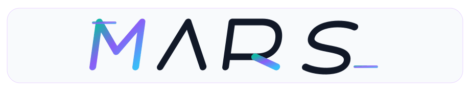
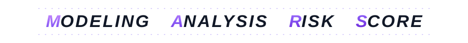
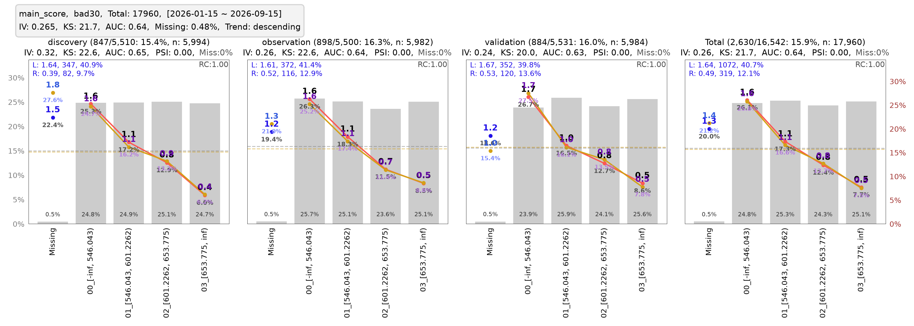

[中文](README.md) / **English**

<p align="center">
<picture>
<source media="(prefers-reduced-motion: reduce)" srcset="docs/assets/mars-logo.svg">
<source media="(prefers-color-scheme: dark)" srcset="docs/assets/mars-logo-dark.gif">

</picture>
<br>

</p>
<p align="center">
  <a href="https://pypi.org/project/mars-risk/"></a>
  <a href="https://leeesq.github.io/mars-risk/"></a>
  <a href="https://pypi.org/project/mars-risk/"></a>
  <a href="https://pepy.tech/project/mars-risk"></a>
  <a href="https://github.com/leeesq/mars-risk/actions/workflows/test.yml"></a>
  <a href="LICENSE"></a>
</p>

<h1 align="center">A high-performance risk analysis toolkit for humans and AI agents</h1>
<p align="center"><strong>Data profiling · Binning evaluation · Feature selection · Correlation analysis · Score cross analysis · Rule mining</strong></p>
<p align="center">Turn Pandas or Polars data into risk evidence you can inspect, query, deliver and reuse.<br>Native charts for analysts. Structured reports for your modeling, monitoring and analysis agents.</p>
<p align="center"><a href="https://leeesq.github.io/mars-risk/getting-started/quickstart/">Start analyzing</a> · <a href="https://leeesq.github.io/mars-risk/demos/">Practical cases</a> · <a href="https://leeesq.github.io/mars-risk/user-guide/external-agents/">Build with AI agents</a> · <a href="https://leeesq.github.io/mars-risk/">Documentation · 中文</a></p>

<p align="center">
<a href="https://leeesq.github.io/mars-risk/assets/cases/binning-native-main-score.svg">

</a>
</p>

<p align="center"><sub>Native MARS binning chart, exported from the same analysis as its tables. Click for the full-resolution SVG.</sub><br>
<a href="https://leeesq.github.io/mars-risk/demos/binning-stability/">Binning and stability case</a> · <a href="https://leeesq.github.io/mars-risk/assets/cases/binning.html">Open the interactive report</a></p>

## What MARS brings to your workflow

MARS uses Polars for calculation and accepts Pandas or Polars wide tables. It brings data profiling, binning, risk evaluation, feature selection, correlation and rule analysis into a shared set of reports. Inspect distributions, compare populations and periods, understand selection decisions, then deliver the results as charts, HTML or Excel.

The same results are available to **external AI agents** through public report APIs. Tables, metric semantics, feature metadata, calculation states and replayable evidence remain queryable after saving and loading. Your agent can use MARS as its analysis layer and combine it with the model libraries, experiment tools and business workflow you choose.

| Capability | What you can inspect | Practical example |
| --- | --- | --- |
| Data profiling | Missing and special values, sample and label coverage, distributions | [Check whether the data is ready](https://leeesq.github.io/mars-risk/demos/data-quality/) |
| Binning and risk evaluation | Native trend charts, fixed bins, multi-target IV / KS / PSI, count and amount risk | [Compare discrimination and stability](https://leeesq.github.io/mars-risk/demos/binning-stability/) |
| Feature selection | Candidate decisions and reasons across screening stages | [Understand retained and removed features](https://leeesq.github.io/mars-risk/demos/selection-correlation/) |
| Correlation analysis | Signed redundancy and separate raw / WOE evidence | [Inspect related features](https://leeesq.github.io/mars-risk/demos/selection-correlation/#correlation) |
| Score cross analysis | Risk separation within a main-score tier and combination evidence | [Compare auxiliary scores](https://leeesq.github.io/mars-risk/demos/score-cross/) |
| Rule mining · Experimental | Candidate origins, screening, coverage and independent validation | [Review rules with evidence](https://leeesq.github.io/mars-risk/demos/rule-evidence/) |

[All seven cases](https://leeesq.github.io/mars-risk/demos/) use 18,000 synthetic applications with separate discovery, validation and observation partitions. Charts and Agent queries consume the actual reports. The statistics demonstrate the interfaces and do not establish real lending outcomes.

## Build your agents on MARS

MARS provides the calculation and evidence layer. You supply orchestration, model training and business decisions.

| Your external agent | MARS building blocks | Useful output |
| --- | --- | --- |
| Modeling agent | Data quality, binning, feature selection, correlation and risk evaluation | Feature candidates, removal reasons and evaluation evidence for your chosen training tools |
| Monitoring and diagnosis agent | Grouped profiles, missing and distribution changes, fixed-bin risk trends and stability | Locate changing populations or features, gather evidence and propose hypotheses to validate |
| Rule analysis agent | Candidate rules, hit evaluation, discovery audit and independent validation | Reviewable candidates with risk, coverage and validation results |
| Report analysis agent | Report catalog, business metadata, bounded queries, snapshots and evidence references | Continue an analysis across sessions and deliver traceable answers |

These are workflows you can build with MARS; complete agents are composed by the user. The optional <code>mars.agent</code> integration also consumes the public report interface. [External Agent guide · 中文](https://leeesq.github.io/mars-risk/user-guide/external-agents/) · [Rule evidence guide · 中文](https://leeesq.github.io/mars-risk/user-guide/rule-reports-and-agents/).

## Install

The examples follow **main / source version 0.0.28**. Install the current source:

```bash
pip install "git+https://github.com/leeesq/mars-risk.git"
```

PyPI currently publishes **0.0.27**, which does not contain all capabilities shown here. The base package supports Python **3.8–3.12**; Python 3.8 uses a frozen dependency stack. Use **Python 3.10+** for optional modeling, tuning, notebooks, documentation development and the built-in Agent SDK. [Installation and extras · 中文](https://leeesq.github.io/mars-risk/getting-started/installation/).

## Start with one report

Run this self-contained example in an empty working directory:

```python
import polars as pl

from mars.analysis import profile_risk

df = pl.DataFrame({
    "date": ["2026-01-01"] * 4 + ["2026-02-01"] * 4,
    "income": [3200, 3600, 5200, 6100, 3400, 4300, 5800, 6800],
    "utilization": [0.72, 0.61, 0.29, 0.18, 0.66, 0.48, 0.24, 0.12],
    "target": [1, 1, 0, 0, 1, 1, 0, 0],
}).with_columns(pl.col("date").str.to_date())
report = profile_risk(
    df, target="target", features=["income", "utilization"],
    time_col="date", method="quantile", n_bins=4,
).report
print(report.get_table("summary", sort_by="iv", descending=True, limit=2))
report.write_html("risk_report.html", chart_embed_mode="inline")
report.save("risk_report.marsreport")
```

[Shared runnable source](docs/snippets/readme_quickstart.py) · [Full quickstart · 中文](https://leeesq.github.io/mars-risk/getting-started/quickstart/). The eight-row sample explains the API. For a full trend chart and downloadable results, use the [binning case](https://leeesq.github.io/mars-risk/demos/binning-stability/). Native figures can be saved directly as SVG or high-resolution PNG with <code>report.save_risk_trend_images()</code>.

## Give the same result to an AI agent

In a new process, load the saved report and query only the evidence you need:

```python
from mars.reporting import load_report

report = load_report("risk_report.marsreport")
description = report.describe()
page = report.query_page("summary", limit=1)
next_page = report.query_page("summary", offset=page["next_offset"], limit=1)
context_json = report.to_ai_context(tables=["summary"], max_chars=16000)
```

<code>describe()</code> exposes the real table catalog, semantics, parameters and states. <code>query_page()</code> returns rows, pagination and a replayable evidence reference. <code>to_ai_context()</code> produces bounded JSON; **<code>max_chars</code> counts characters, not tokens**. The consumer does not need an LLM, API key, <code>MarsAgentSession</code>, original table or analyzer merely to query the saved results.

Loading returns a **ReportSnapshot** with saved statistics and metadata. <code>report.write_excel("risk_report.xlsx")</code> exports static tables, and <code>report.show_table("summary", limit=10)</code> displays them. Questions requiring new dimensions or original records need a new calculation. [Save and query results](https://leeesq.github.io/mars-risk/demos/saved-reports/) · [Deliver HTML, Excel, snapshots and Agent materials](https://leeesq.github.io/mars-risk/demos/report-delivery/).

## Development focus

**Analysis, Feature and Reporting are Stable. Rule, Monitoring, Modeling, Pipeline, Scoring and Agent are Experimental.** These labels describe interface maturity.

Current development focuses on core analysis performance, memory efficiency, human use and external Agent consumption. **Monitoring, Modeling (including Pipeline) and Scoring are paused for feature development.** Existing functionality and documentation remain, with necessary fixes and direct adaptation to upstream changes. Combine AI, MARS analysis and your own model tools to build tailored workflows. These downstream modules adapt to the core; upstream code does not retain compatibility aliases or redundant computation for them.

[Stability policy · 中文](https://leeesq.github.io/mars-risk/project/stability/) · [Retained LightGBM example · 中文](https://leeesq.github.io/mars-risk/demos/history/).

## Reproduce and contribute

```bash
git clone https://github.com/leeesq/mars-risk.git
cd mars-risk
pip install -e ".[docs]"
python docs/snippets/task_cases.py --case all --output-dir output/task-cases
```

[Case downloads and reproducibility](https://leeesq.github.io/mars-risk/demos/#run) · [Contribution guide](CONTRIBUTING.md) · [Engineering Skill](.codex/skills/mars-risk-engineering/SKILL.md) · [MIT License](LICENSE).
