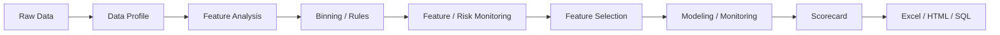

# MARS

<div align="center">

```text
 __________________________________________________________________________
    __  ___ ___    ____  _____
   /  |/  //   |  / __ \/ ___/
  / /|_/ // /| | / /_/ /\__ \
 / /  / // ___ |/ _, _/___/ /
/_/  /_//_/  |_/_/ |_|/____/

 MODELING ANALYSIS RISK SCORE
 __________________________________________________________________________
```

**面向信贷风控建模的 Polars-first 工具库，覆盖数据画像、特征分析、特征监控、风险评估、自动建模、模型监控与评分卡落地。**

[](https://pypi.org/project/mars-risk/)
[](https://pypi.org/project/mars-risk/)
[](https://github.com/leeesq/mars-risk/actions/workflows/test.yml)
[](LICENSE)

`Profile -> Analyze -> Monitor -> Bin -> Select -> Model -> Score -> Export`

[项目简介](#项目简介) · [设计取向](#设计取向) · [能力地图](#能力地图) · [性能对比](#性能对比) · [安装](#安装) · [快速开始](#快速开始) · [核心-api-约定](#核心-api-约定) · [自动建模](#自动建模) · [FAQ](#faq)

</div>

## 项目简介

MARS 是一个围绕信贷风控建模日常流程设计的 Python 工具库。它覆盖数据画像、特征分析、特征监控、分箱评估、IV/KS/AUC/PSI 指标、特征筛选、模型调参、Top-K replay、模型监控、评分卡和报表导出，目标是把分散在脚本、Notebook 和 Excel 中的重复工作整理成可复用的工程链路。

它不是单点算法封装，而是一条面向建模、验证、监控和部署的工程链路：从原始宽表出发，先识别特征质量和稳定性，再沉淀可复用的分箱与评估规则，最后把模型结果、特征漂移、模型分稳定性和导出产物放进同一套可审计的报告体系。



## 设计取向

- 构造函数保存稳定策略或模型规格；`fit`、`evaluate`、`generate_profile`、`split`、`tune` 接收数据、列名、样本范围和输出选项。
- 高层风控工作流使用 `df, target`；底层算法对象使用 `X, y`。同一个 public method 不同时暴露 `target` 和 `y`。
- 分组和时间命名保持一致：`group_col` 表示已有分组列，`time_col` 表示原始日期列，`time_grain` 表示时间聚合粒度，`dataset_flag_col` 只用于建模样本切片。
- 核心计算优先使用 Polars，兼容 Pandas 输入；报告和导出层按需转换。
- 报告对象保留汇总表、明细表、趋势表和元数据，便于导出、回放和审计。

## 能力地图

| 模块 | 主 API | 典型问题 | 主要产出 |
| --- | --- | --- | --- |
| 数据画像与特征分析 | `MarsDataProfiler` / `profile_stats` | 缺失率、零值、均值/分布、PSI、时间趋势、特征来源分组 | `MarsProfileReport` |
| 分箱转换 | `MarsNativeBinner` / `MarsOptimalBinner` | 连续/类别分箱、规则映射、部署转换、SQL 生成 | 分箱规则、映射表、SQL |
| 特征监控/风险画像 | `MarsBinEvaluator` / `profile_risk` | IV、KS、AUC、PSI、Lift、缺失趋势、分箱趋势、按月/周/分组监控 | `MarsRiskProfile`、`MarsEvaluationReport` |
| 特征筛选 | `MarsStatsSelector` / `MarsLinearSelector` / `MarsImportanceSelector` | 质量筛选、稳定性、相关性、模型重要性 | `selected_features_`、筛选报告 |
| 自动建模与模型监控 | `MarsModelingSession` / `MarsModelTuner` / `MarsModelReplayRunner` | train/val/oot 评估、benchmark 对比、Score PSI、feature PSI、重要性表、Top-K replay | `MarsModelTuningResult`、`MarsModelReplayResult`、`MarsModelingReport` |
| 评分卡与导出 | `build_scorecard` | LR 系数转评分卡、部署 SQL、分数映射 | `MarsScorecard` |

## 性能对比

MARS 最初的设计动机之一是让宽表风控分箱和规则转换更快。下面结果来自本仓库的可复现脚本：

```bash
conda run -n mars python benchmarks/benchmark_binning_speed.py native --rows 200000 --features 3000 --repeats 1
conda run -n mars python benchmarks/benchmark_binning_speed.py optimal --rows 50000 --features 1000 --repeats 3
```

- 计时范围：数据生成 + fit + WOE transform + 本轮清理
- 内存口径：主进程及其子进程的 RSS；结束增量为本轮结束 RSS - 起始 RSS，峰值增量为采样峰值 RSS - 起始 RSS
- Python：`3.10.19`；系统：`Windows-10-10.0.26200-SP0`
- `toad` 仅为本地竞品对比临时安装，不属于 MARS 项目依赖
- 结束增量会受 Python、Polars、NumPy 内存分配器缓存影响；比较峰值压力时优先看“峰值增量”

### 原生分箱：toad vs MarsNativeBinner

- 数据规模：`200,000` 行 × `3,000` 个数值特征
- 重复次数：`1`；随机种子：`2026`

| 场景 | 方法 | 平均耗时(s) | 最快(s) | 最慢(s) | 平均结束增量(MB) | 峰值增量(MB) | 相对基准 | 备注 |
| --- | --- | ---: | ---: | ---: | ---: | ---: | ---: | --- |
| 等频分箱 | toad Combiner + WOETransformer | 126.083 | 126.083 | 126.083 | 30.7 | 20516.1 | 1.60x | 先运行；外部竞品库，不属于项目依赖 |
| 等频分箱 | MarsNativeBinner | 78.768 | 78.768 | 78.768 | 3348.2 | 6768.8 | 1.00x | method=quantile |
| 等宽分箱 | toad Combiner + WOETransformer | 105.859 | 105.859 | 105.859 | 6.7 | 20468.4 | 1.31x | 先运行；外部竞品库，不属于项目依赖 |
| 等宽分箱 | MarsNativeBinner | 81.058 | 81.058 | 81.058 | -7.8 | 6727.7 | 1.00x | method=uniform |

### 原生等频/等宽的额外能力

MARS 的原生等频/等宽分箱不只是生成切点。围绕风控特征分析和监控，常规工具通常需要额外脚本补齐的处理，在 `MarsNativeBinner` 中尽量内聚为同一套规则对象：

- 缺失值、`NaN`、自定义 `missing_values` 和业务特殊值 `special_values` 会独立隔离，不挤占正常分箱数量。
- `merge_small_bins` 可在等频/等宽后自动合并低占比碎片箱，减少极端宽表中的不稳定分箱。
- `remove_empty_bins` 可在等宽场景自动清理空箱，适配长尾、零膨胀和稀疏分布。
- 同一套规则支持 `index` / `label` 映射、`LazyFrame` 延迟转换，以及 Pandas/Polars 输入。
- 类别特征支持 Top-K 保留、长尾归并、未知类别落入 `Other`，高基数类别可走 Join 映射路径。
- 分箱规则可以继续进入特征分析、特征监控、模型监控和 SQL 导出链路，减少从探索到部署之间的规则重写。

### 最优分箱：MarsOptimalBinner vs optbinning

- 数据规模：`50,000` 行 × `1,000` 个数值特征
- 重复次数：`3`；随机种子：`2026`

| 场景 | 方法 | 平均耗时(s) | 最快(s) | 最慢(s) | 平均结束增量(MB) | 峰值增量(MB) | 相对基准 | 备注 |
| --- | --- | ---: | ---: | ---: | ---: | ---: | ---: | --- |
| 最优分箱 | MarsOptimalBinner | 28.011 | 26.627 | 29.189 | 282.0 | 5531.5 | 1.00x | 单特征 time_limit=1s |
| 最优分箱 | optbinning.BinningProcess | 125.826 | 124.474 | 126.538 | 17.0 | 628.4 | 4.49x | 单特征 time_limit=1s |

## 安装

MARS 支持 `Python >= 3.10`。

```bash
pip install mars-risk
```

| 场景 | 安装命令 |
| --- | --- |
| 基础画像、分箱、筛选 | `pip install mars-risk` |
| Excel 导出 | `pip install "mars-risk[excel]"` |
| 绘图报告 | `pip install "mars-risk[plot]"` |
| Notebook 交互 | `pip install "mars-risk[notebook]"` |
| 树模型与调参 | `pip install "mars-risk[ml,tuning]"` |
| 本地开发 | `pip install -e ".[dev,ml,tuning]"` |

```bash
git clone https://github.com/leeesq/mars-risk.git
cd mars-risk
pip install -e ".[dev,ml,tuning]"
```

## 快速开始

下面的示例保持短小，展示主链路的新 API 约定。完整流程见 [tutorial/quickstart.md](tutorial/quickstart.md)。

### 准备样本

```python
import polars as pl

df = pl.DataFrame(
    {
        "apply_dt": [
            "2024-01-03", "2024-01-10", "2024-01-17", "2024-01-24",
            "2024-02-03", "2024-02-10", "2024-02-17", "2024-02-24",
            "2024-03-03", "2024-03-10", "2024-03-17", "2024-03-24",
        ],
        "month": [
            "2024-01", "2024-01", "2024-01", "2024-01",
            "2024-02", "2024-02", "2024-02", "2024-02",
            "2024-03", "2024-03", "2024-03", "2024-03",
        ],
        "income": [3200, 3600, -999, None, 3300, 4200, -999, 5800, 3400, 4300, None, 6100],
        "utilization": [0.12, 0.18, 0.52, 0.61, 0.14, 0.29, 0.54, 0.58, 0.16, 0.31, 0.56, 0.63],
        "segment": ["new", "repeat", "vip", "vip", "new", "repeat", "vip", "vip", "new", "repeat", "vip", "vip"],
        "target": [0, 0, 1, 1, 0, 1, 1, 1, 0, 1, 1, 1],
    }
)
```

### 数据画像

```python
from mars.analysis import MarsDataProfiler, profile_stats

profiler = MarsDataProfiler(missing_values=[-999])
profile_report = profiler.generate_profile(
    df,
    group_col="month",
    config_overrides={
        "enable_sparkline": False,
        "dq_metrics": ["missing", "zeros"],
        "stat_metrics": ["mean", "psi"],
    },
)

quick_report = profile_stats(
    df,
    metrics=["missing", "mean"],
    features=["income", "utilization"],
    group_col="month",
    missing_values=[-999],
)
```

### 风险画像

```python
from mars.analysis import profile_risk

risk_profile = profile_risk(
    df,
    target="target",
    features=["income", "utilization", "segment"],
    group_col="month",
    binning_type="native",
    binner_params={"method": "quantile", "n_bins": 4},
    plot=False,
)

eval_report = risk_profile.report
binner = risk_profile.binner
summary = eval_report.summary_table
```

`profile_risk()` 返回 `MarsRiskProfile(report, binner, targets, metadata)`。`report` 用于查看和导出风险画像报表，`binner` 用于复用本次分箱规则。

### 分箱器

```python
from mars.feature import MarsNativeBinner

X = df.select(["income", "utilization", "segment"])
y = df.get_column("target")

binner = MarsNativeBinner(method="quantile", n_bins=4, special_values=[-999])
binner.fit(X, y, cat_features=["segment"])

X_bin = binner.transform(X, return_type="index")
X_woe = binner.transform(X, return_type="woe")
income_mapping = binner.get_bin_mapping("income")
```

### 特征筛选

```python
from mars.feature import MarsStatsSelector

selector = MarsStatsSelector(
    missing_thr=0.9,
    iv_thr=0.01,
    psi_thr=0.25,
    skip_fine_scan=True,
)

selector.fit(
    df,
    target="target",
    features=["income", "utilization", "segment"],
    group_col="month",
)

selected_features = selector.selected_features_
selection_report = selector.get_eval_report(df)
```

### 自动建模

建模调参需要安装 `ml` 和 `tuning` 可选依赖。

```python
from mars.modeling import MarsModelingSession
from mars.modeling.tuning import MarsModelReplayRunner

session = MarsModelingSession(
    model_type="xgb",
    features=["income", "utilization", "segment"],
    target="target",
    categorical_features=["segment"],
    optimize_metric="ks",
    seed=1206,
)

modeling_df = session.slice(
    df,
    time_col="apply_dt",
    split_ratios={"train": 0.6, "val": 0.2, "oot": 0.2},
)

tuning_result = session.tune(
    modeling_df,
    n_trials=20,
    history_path=None,
)

replay_result = MarsModelReplayRunner().run(
    tuning_result,
    modeling_df,
    top_k=3,
    sort_metric="ks",
)
```

## 核心 API 约定

| 场景 | 约定 |
| --- | --- |
| 高层风控工作流 | 使用 `df, target`，例如 `profile_risk(df, target="y")` |
| 底层算法对象 | 使用 `X, y`，例如 `MarsNativeBinner().fit(X, y)` |
| 构造函数 | 放稳定策略、阈值、模型规格，不放本次样本数据 |
| 方法入参 | 放数据、列名、特征范围、分组、时间、输出路径 |
| 分组命名 | `group_col` 是已有分组列，`time_col` 是原始日期列，`time_grain` 是聚合粒度 |
| 建模切片 | `dataset_flag_col` 只表示 train/val/oot 等建模样本切片 |
| 文件输出 | 路径参数支持 `str | Path`；`history_path=None` 表示不写调参历史文件 |

## 自动建模

| API | 职责 | 返回值 |
| --- | --- | --- |
| `MarsModelDataSplitter` | 无状态样本切分工具 | 与输入类型一致的 DataFrame |
| `MarsModelingSession` | 组织切分、调参、replay 和增量特征调参 | 会话对象 |
| `MarsModelTuner` | 对单个模型后端执行 Optuna 调参 | `MarsModelTuningResult` |
| `MarsModelReplayRunner` | 从调优结果中读取规格并回放 Top-K trial | `MarsModelReplayResult` |
| `MarsModelEvaluator` | 对已打分样本构建模型评估报告 | `MarsModelingReport` |
| `MarsFeatureIncrementalTuner` | 按特征数量逐步扩展调参 | `MarsFeatureGrowthResult` |

`MarsModelTuningResult` 会保存最佳模型、调参历史、特征重要性、训练配置和 artifact 元数据。`MarsModelReplayResult` 会保存 replay leaderboard、模型字典、打分数据、评估报告和重要性表。

模型分可以被视为一个特殊特征进入稳定性监控。当前 `MarsModelEvaluator` 已输出 `Score PSI` 和 `score_psi` 明细，用于观察模型分在 train/val/oot 或业务切片之间的分布漂移；后续会补充模型分分箱后的趋势统计，例如分箱均值、样本量、坏账率和分数区间迁移，用于更细粒度的模型监控。

## 报告与导出

画像、风险评估、建模评估和评分卡结果都以对象形式返回。常见出口包括：

```python
profile_report.write_excel("mars_profile.xlsx")
eval_report.write_excel("mars_evaluation.xlsx", engine="openpyxl")
eval_report.write_html("mars_evaluation.html")
```

评分卡链路支持从逻辑回归模型和 WOE 分箱结果生成分数映射，并导出 SQL 规则。

## 公开 API 概览

| 导入位置 | 公开对象 |
| --- | --- |
| `mars.analysis` | `MarsDataProfiler`、`MarsBinEvaluator`、`MarsRiskProfile`、`profile_stats`、`profile_risk` |
| `mars.feature` | `MarsNativeBinner`、`MarsOptimalBinner`、`MarsStatsSelector`、`MarsLinearSelector`、`MarsImportanceSelector` |
| `mars.modeling` | `MarsModelingSession` |
| `mars.modeling.tuning` | `MarsModelTuner`、`MarsModelReplayRunner` |
| `mars.modeling.slicing` | `MarsModelDataSplitter` |
| `mars.modeling.results` | `MarsModelTuningResult`、`MarsModelReplayResult` |
| `mars.modeling.feature_growth` | `MarsFeatureGrowthResult`、`MarsFeatureIncrementalTuner` |
| `mars.scoring` | `MarsScorecard`、`build_scorecard` |

## 可选依赖

- `excel`：Excel 导出。
- `plot`：图表报告。
- `notebook`：Notebook 交互展示。
- `ml`：XGBoost、LightGBM、CatBoost、SHAP、statsmodels。
- `tuning`：Optuna 调参。

## 测试与开发

```bash
python -m ruff check src tests benchmarks
python -m mypy src/mars
MPLBACKEND=Agg python -m pytest -q --basetemp .pytest-tmp
```

本仓库使用 `src/` 包结构，并声明 `mars/py.typed`。提交 Python 代码时，请保持类型注解、NumPy 风格 docstring、中文自然语言注释和 README/教程同步。

## FAQ

### `profile_risk()` 返回什么？

返回 `MarsRiskProfile(report, binner, targets, metadata)`。其中 `report` 是风险评估报告，`binner` 是本次拟合或复用的分箱器，`targets` 是目标列列表，`metadata` 保存运行上下文。

### 为什么高层 API 用 `target`，底层对象用 `y`？

高层 API 面向完整业务表，目标变量是某个列名，所以使用 `df, target`。底层算法对象面向特征矩阵和标签向量，所以使用 `X, y`。这样可以避免同一个方法里同时出现列名和标签向量两种语义。

### `MarsModelTuner.tune(history_path=None)` 会写文件吗？

不会。`history_path=None` 时调参历史只保存在返回对象中。传入路径时才写 CSV；如果路径已存在且 `overwrite=False`，会抛出 `FileExistsError`。

### Pandas 和 Polars 都能用吗？

可以。核心计算优先走 Polars；Pandas 输入会在需要时转换或保持原类型返回。建模切分器会根据输入类型选择对应实现，避免不必要的跨框架转换。

## 路线图

- 继续扩展模型评估、特征监控和报表导出的测试覆盖。
- 补充模型分分箱后的趋势统计，包括分箱均值、样本量、坏账率和分数区间迁移。
- 增强模型监控报表、评分卡 SQL 和 artifact 回放能力。
- 梳理更多教程场景，保持 README 轻量，详细流程放在 `tutorial/`。
- 持续收敛 public API 命名和类型注解。

## 参与方式

欢迎提交 issue、测试用例、文档修正和真实建模场景反馈。PR 请尽量附上最小复现、测试命令和对 public API 的影响说明。

## 许可证

本项目使用 [LICENSE](LICENSE) 中声明的开源许可证。
