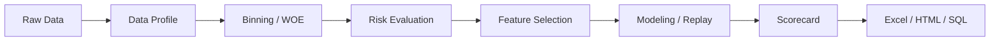

# MARS

<div align="center">

```text
 __________________________________________________________________________
    __  ___ ___    ____  _____
   /  |/  //   |  / __ \/ ___/
  / /|_/ // /| | / /_/ /\__ \
 / /  / // ___ |/ _, _/___/ /
/_/  /_//_/  |_/_/ |_|/____/

 MODELING ANALYSIS RISK SCORE
 __________________________________________________________________________
```

**A fast risk-modeling cockpit for profile, binning, evaluation, selection, modeling, scorecard and export.**

[](https://pypi.org/project/mars-risk/)
[](https://pypi.org/project/mars-risk/)
[](https://github.com/leeesq/mars-risk/actions/workflows/test.yml)
[](LICENSE)

`Profile -> Bin -> Evaluate -> Select -> Model -> Score -> Export`

[护城河](#护城河polars-first-性能底座) · [能力地图](#能力地图) · [快速开始](#快速开始) · [自动建模舱](#自动建模舱) · [公开 API](#公开-api-概览)

</div>

## 一句话

MARS 是一个面向信贷风控、评分卡建模和特征稳定性监控的 Python 工具库。它把日常建模里最分散、最反复、最容易沉在 Excel 和脚本里的动作，收敛成一条可以复用、可以导出、可以回放的工程链路。



## 护城河：Polars-first 性能底座

MARS 最大的护城河不是“多包一层 API”，而是把风控建模的高频计算尽量落在 `polars` 这套更现代的列式执行底座上。面对宽表画像、批量分箱、WOE 映射、IV/KS/AUC/PSI 评估和跨期稳定性分析时，传统 pandas/toad 风格链路很容易退化成大量逐列循环和重复扫描；MARS 的设计目标是把这些动作改写成更批量、更少 Python 解释器参与的计算流程。

| 性能来自哪里 | 设计取向 |
| --- | --- |
| 列式执行 | 核心统计优先使用 `polars` 表达式，少做逐列 Python 循环 |
| 批量评估 | 分箱、WOE、IV、KS、AUC、PSI 尽量批量化，减少重复扫描 |
| 漏斗筛选 | 粗筛、精筛、稳定性、相关性分阶段推进，先用低成本规则压缩特征空间 |
| 结果沉淀 | 报告对象直接沉淀 Excel、HTML、SQL，减少“算完再手工拼表”的时间 |

所以 MARS 不是只想做一个漂亮报告工具。它真正想做的是一条基于 Polars 的风控建模工程链路：同样是画像、分箱、评估、筛选和导出，尽量让底层计算更接近列式批处理，而不是把时间耗在一层层 Python 循环里。

## 能力地图

| 模块 | 主 API | 解决什么问题 | 产出 |
| --- | --- | --- | --- |
| 数据画像 | `MarsDataProfiler` / `profile_stats` | 缺失、零值、众数、分布、趋势、PSI | `MarsProfileReport` |
| 分箱转换 | `MarsNativeBinner` / `MarsOptimalBinner` | 连续/类别分箱、WOE 映射、SQL 生成 | 分箱规则、映射表、SQL |
| 风险评估 | `MarsBinEvaluator` / `profile_risk` | IV、KS、AUC、PSI、单调性、趋势报表 | `MarsEvaluationReport` |
| 特征筛选 | `MarsStatsSelector` | 质量筛选、粗筛、精筛、稳定性、相关性漏斗 | `selected_features_`、筛选报告 |
| 自动建模 | `MarsModelingSession` | 切分、调参、评估、回放 | `MarsModelingRun`、`MarsModelingReport` |
| 评分卡与导出 | `build_scorecard` | LR 系数转评分卡、分数表、SQL | `MarsScorecard` |

## 为什么值得一试

### Polars-first

- 核心计算优先走 `polars`，适合更宽、更大的特征表。
- 仍然支持直接传入 Pandas DataFrame，不强迫你一次性迁移。
- 展示层和 Excel 导出层按需转 Pandas，计算层尽量保持轻快。

### 风控工作流优先

- 不只是一个分箱器，也不只是一个 PSI 函数。
- 从画像、分箱、评估、筛选到导出，尽量贴近日常风控建模节奏。
- 报告对象保留明细表、汇总表、趋势表和上下文，结果不是一次性输出。

### 可落地

- Excel、HTML、SQL 都能作为交付出口。
- 分箱器可复用，评估器可回放，筛选器能沉淀名单。
- API 风格靠近 `sklearn`，适合接进已有建模脚本。

## 适合什么场景

- 信贷风控特征初筛与特征健康巡检。
- 评分卡开发中的分箱、WOE、IV、KS、PSI 和单调性检查。
- 月度、周度或客群维度的特征稳定性监控。
- 将分析结果导出给业务、策略、模型管理或审计团队。
- Pandas 项目逐步迁移到 Polars 的中间阶段。

## 当前状态

MARS 仍处于 `0.x` 阶段，但主链路已经可以支撑实际分析和日常工作。当前仓库已经补上 pytest、Ruff、Mypy、CI、typed package、extras、教程和核心 README。后续重点会继续放在测试覆盖、文档一致性和 Polars 实现的工程化打磨上。

## 安装

`Python >= 3.10`

```bash
pip install mars-risk
```

| 场景 | 命令 |
| --- | --- |
| 基础能力 | `pip install mars-risk` |
| Excel 导出 | `pip install "mars-risk[excel]"` |
| 绘图报告 | `pip install "mars-risk[plot]"` |
| Notebook 交互 | `pip install "mars-risk[notebook]"` |
| 建模调参与树模型 | `pip install "mars-risk[ml,tuning]"` |
| 本地开发 | `pip install -e ".[dev,ml,tuning]"` |

```bash
git clone https://github.com/leeesq/mars-risk.git
cd mars-risk
pip install -e ".[dev,ml,tuning]"
```

## 快速开始

下面这组示例尽量覆盖 MARS 的主线工作流。

### 1. 准备一份小型样例数据

```python
import polars as pl

df = pl.DataFrame(
    {
        "month": [
            "2024-01", "2024-01", "2024-01", "2024-01",
            "2024-02", "2024-02", "2024-02", "2024-02",
            "2024-03", "2024-03", "2024-03", "2024-03",
        ],
        "income": [3200, 3600, -999, None, 3300, 4200, -999, 5800, 3400, 4300, None, 6100],
        "utilization": [0.12, 0.18, 0.52, 0.61, 0.14, 0.29, 0.54, 0.58, 0.16, 0.31, 0.56, 0.63],
        "segment": ["new", "repeat", "vip", "vip", "new", "repeat", "vip", "vip", "new", "repeat", "vip", "vip"],
        "target": [0, 0, 1, 1, 0, 1, 1, 1, 0, 1, 1, 1],
    }
)
```

### 2. 做一次数据画像

```python
from mars.analysis import MarsDataProfiler

profiler = MarsDataProfiler(
    df,
    missing_values=[-999],
)

profile_report = profiler.generate_profile(
    profile_by="month",
    config_overrides={
        "enable_sparkline": False,
        "dq_metrics": ["missing", "zeros"],
        "stat_metrics": ["mean", "psi"],
    },
)

overview = profile_report.overview_table
missing_trend = profile_report.dq_tables["missing"]
psi_trend = profile_report.stats_tables["psi"]
```

你通常会从这里开始：

- `overview` 看整张表的全局画像
- `dq_tables["missing"]` 看缺失率趋势
- `stats_tables["psi"]` 看稳定性变化

导出画像报表：

```python
profile_report.write_excel("mars_profile.xlsx")
```

```python
from mars.analysis import profile_stats

quick_profile = profile_stats(
    df,
    metrics=["missing", "mean"],
    features=["income", "utilization"],
    profile_by="month",
    missing_values=[-999],
)

quick_profile.show_overview()
quick_profile.show_trend("missing")
```

### 3. 一键做特征评估

`profile_risk()` 的返回值是：

```python
(report, evaluator)
```

其中：

- `report` 负责承载汇总表、趋势表、明细表和报表导出
- `evaluator` 保留拟合后的分箱器和评估上下文，便于继续复用

```python
from mars.analysis import profile_risk

eval_report, evaluator = profile_risk(
    df,
    target="target",
    features=["income", "utilization", "segment"],
    profile_by="month",
    binning_type="native",
    n_bins=4,
    binner_kwargs={"method": "quantile"},
    plot=False,
)

summary = eval_report.summary_table
detail = eval_report.detail_table
trend_psi = eval_report.trend_tables["psi"]
```

导出评估报表：

```python
eval_report.write_excel("mars_evaluation.xlsx", engine="openpyxl")
eval_report.write_html("mars_evaluation.html")
```

### 4. 直接使用分箱器

```python
from mars.feature import MarsNativeBinner

X = df.select(["income", "utilization", "segment"])
y = df.get_column("target")

binner = MarsNativeBinner(
    method="quantile",
    n_bins=4,
    cat_features=["segment"],
    special_values=[-999],
)

binner.fit(X, y)
X_binned = binner.transform(X, return_type="index")
X_woe = binner.transform(X, return_type="woe")
income_mapping = binner.get_bin_mapping("income")
```

如果你希望把分箱逻辑拿到 SQL 里部署：

```python
sql = binner.generate_sql(
    features=["income", "utilization"],
    table_prefix="t",
    return_type="woe",
)
```

### 5. 生成评分卡

```python
from mars.scoring import build_scorecard

scorecard = build_scorecard(
    binner=binner,
    coefficients={"income": -0.35, "utilization": 0.82},
    intercept=-1.1,
    pdo=50,
    base_score=600,
    base_odds=20,
)

scorecard.write_excel("mars_scorecard.xlsx")
sql_score = scorecard.generate_sql(table_prefix="t", score_name="credit_score")
```

### 6. 做一轮特征筛选

```python
from mars.feature import MarsStatsSelector

selector = MarsStatsSelector(
    target="target",
    profile_by="month",
    rough_iv_thr=0.01,
    iv_thr=0.02,
    psi_thr=0.25,
    rc_thr=0.5,
)

selector.fit(df)

selected_features = selector.selected_features_
selector.export_selector_report("mars_selector_report.xlsx")
selector.save_selector_lists("mars_lists.json")
```

`MarsStatsSelector` 内部是一个漏斗式筛选流程，典型阶段包括：

- 数据质量校验
- 原生分箱粗筛
- 最优分箱精筛
- PSI 稳定性过滤
- 风险一致性过滤
- 相关性去重

## 自动建模舱

自动建模是 MARS 主链路的一部分，不是附属能力。顶层 `MarsModelingSession` 负责把 `slice -> tune -> evaluate -> replay` 串起来；低层对象则放在 `mars.modeling.tuning`、`mars.modeling.evaluation`、`mars.modeling.report` 等显式模块里，方便你按需要拆开用。

| 对象 | 角色 |
| --- | --- |
| `MarsModelingSession` | 会话级入口，适合一条链路跑通切分、调参、评估和回放 |
| `MarsModelTuner` | 低层调参器，适合需要更细控制的场景 |
| `MarsModelReplay` | 基于调参历史回放候选模型 |
| `MarsModelEvaluator` | 汇总验证集、OOT、时间切片等模型表现 |
| `MarsModelingRun` / `MarsReplayRun` | 可复用的结果对象 |

```python
from mars.modeling import MarsModelingSession
from mars.modeling.evaluation import MarsModelEvaluator
from mars.modeling.tuning import MarsModelReplay, MarsModelTuner

tuner = MarsModelTuner(
    model_type="xgb",
    features=["income", "utilization"],
    target="target",
    optimize_metric="ks",
)

tuning_run = tuner.tune(scored_df, n_trials=20)

replay = MarsModelReplay(
    model_type="xgb",
    features=["income", "utilization"],
    target="target",
    optimize_metric="ks",
)
replay_run = replay.run(tuning_run, scored_df, top_k=3, sort_metric="ks")

evaluator = MarsModelEvaluator(
    group_col="dataset_flag",
    target_col="target",
    time_col="biz_dt",
)
top_pred_col = next(
    col for col in replay_run.scored_df.columns if str(col).startswith("prob_top1_trial")
)
report = evaluator.evaluate(replay_run.scored_df, pred_col=top_pred_col)

session = MarsModelingSession(
    model_type="xgb",
    features=["income", "utilization"],
    target="target",
    optimize_metric="ks",
)
same_run = session.tune(scored_df, n_trials=20)
same_report = session.evaluate(scored_df, pred_col="pred_score")
```

## 输入输出约定

这是 README 里最值得提前讲清楚的一部分。

### Polars / Pandas 约定

- 传入 `Polars DataFrame`，核心报告对象会优先保持 `Polars`
- 传入 `Pandas DataFrame`，核心报告对象会优先保持 `Pandas`
- 展示层（`Styler` / HTML / Excel）内部会按需转为 Pandas，这是为了兼容样式系统，不代表计算层退回 Pandas

### `profile_risk()` 的返回值

始终返回：

```python
(MarsEvaluationReport, MarsBinEvaluator)
```

不要把它当成只返回一张表的函数来用。

### 无标签模式

如果你把 `target=None` 传给 `profile_risk()`，MARS 会进入无标签模式：

- 仍然可以做分布和稳定性分析
- 仍然可以产出 PSI 等分布类指标
- 但不会再产生依赖真实标签的区分度指标

这对于“监控一批线上样本分布是否漂移”很有用。

## 如何选择分箱器

### `MarsNativeBinner`

推荐作为默认起点。

适合：

- 日常宽表批量评估
- 希望先把流程跑通
- 更看重速度和工程稳定性
- 需要快速得到 WOE / 分箱映射 / SQL

典型配置：

```python
MarsNativeBinner(method="quantile", n_bins=10)
```

### `MarsOptimalBinner`

适合更严肃的评分卡建模场景。

适合：

- 对单调性和切点质量要求更高
- 愿意接受更高的计算成本
- 需要更“评分卡味”的分箱约束

在一键评估里使用：

```python
report, evaluator = profile_risk(
    df,
    target="target",
    profile_by="month",
    binning_type="opt",
    plot=False,
)
```

## 报告对象能做什么

### `MarsProfileReport`

主要入口：

- `overview_table`
- `dq_tables`
- `stats_tables`
- `show_overview()`
- `show_trend(metric)`
- `write_excel(...)`

适合回答这些问题：

- 哪些列缺失高、零值高、众数高
- 哪些特征在不同月份分布波动很大
- 哪些数值统计量在跨期上不稳定

### `MarsEvaluationReport`

主要入口：

- `summary_table`
- `trend_tables`
- `detail_table`
- `show_summary()`
- `show_trend(metric)`
- `write_excel(path, engine="openpyxl")`

适合回答这些问题：

- 哪些特征 IV / KS / AUC 表现更好
- 哪些特征最大 PSI 偏高
- 哪些特征单调性或风险一致性不理想
- 每个分箱的样本占比、坏率、Lift、WOE 是什么

## 公开 API 概览

### `mars.analysis`

| API | 说明 |
| --- | --- |
| `MarsDataProfiler` | 数据画像与趋势分析 |
| `MarsProfileConfig` | 画像配置对象 |
| `MarsProfileReport` | 画像报告对象 |
| `MarsBinEvaluator` | 特征评估器 |
| `MarsEvaluationReport` | 评估报告对象 |
| `profile_stats` | 轻量统计画像入口，适合快速看缺失率/均值等指标 |
| `profile_risk` | 一键评估入口 |

### `mars.feature`

| API | 说明 |
| --- | --- |
| `MarsNativeBinner` | 原生高性能分箱器 |
| `MarsOptimalBinner` | 带约束的最优分箱器 |
| `MarsStatsSelector` | 漏斗式特征筛选器 |

### `mars.modeling`

| API | 说明 |
| --- | --- |
| `MarsModelingSession` | 顶层会话入口，组织切分、调参、评估和回放 |
| `mars.modeling.tuning.MarsModelTuner` | 显式调参器 |
| `mars.modeling.tuning.MarsModelReplay` | 调参历史回放器 |
| `mars.modeling.evaluation.MarsModelEvaluator` | 模型效果评估器 |
| `mars.modeling.results.MarsModelingRun` | 调参结果对象 |
| `mars.modeling.results.MarsReplayRun` | 回放结果对象 |
| `mars.modeling.feature_growth.MarsFeatureIncrementalTuner` | 增量特征建模实验器 |

### `mars.scoring`

| API | 说明 |
| --- | --- |
| `build_scorecard` | 基于已拟合分箱器和 LR 系数生成评分卡 |
| `MarsScorecard` | 评分卡结果对象，支持表格导出与 SQL 生成 |

### 参数兼容提醒

`MarsBinEvaluator` 现在推荐使用：

```python
MarsBinEvaluator(..., binning_type="native")
```

旧参数：

```python
MarsBinEvaluator(..., bining_type="native")
```

仍然兼容，但已经是弃用入口，不建议在新代码里继续使用。

## 教程与仓库资源

推荐阅读顺序：

1. [tutorial/quickstart.md](tutorial/quickstart.md)
2. [tutorial/performance_audit.md](tutorial/performance_audit.md)
3. [tutorial/benchmark_synthetic.py](tutorial/benchmark_synthetic.py)

仓库里同时还保留了一些历史 notebook、样例文件和导出产物，用于开发过程中的验证与参考。  
如果你是第一次接触这个项目，优先看上面的三份内容就够了。

## 可选依赖说明

| Extra | 用途 |
| --- | --- |
| `excel` | `openpyxl`、`xlsxwriter`、`xlwings`，用于 Excel 导出 |
| `plot` | `matplotlib`、`seaborn`，用于风险趋势图绘制 |
| `notebook` | `jupyterlab`，用于 Notebook 交互体验 |
| `ml` | `xgboost`、`lightgbm`、`catboost` |
| `dev` | pytest、Ruff、Mypy、格式化、导出、绘图与基准测试相关依赖 |

## 测试与开发

当前仓库已经包含基于合成数据的 pytest 覆盖，重点保护：

- `MarsNativeBinner` 的分箱与映射行为
- `MarsDataProfiler` 的画像流程和报告输出
- `MarsBinEvaluator` / `profile_risk` 的核心评估路径
- 多目标场景和 Pandas/Polars 返回类型约定
- Excel 模板资源与导出烟测

本地运行静态检查：

```bash
python -m ruff check src tests
python -m mypy src/mars
```

本地运行测试：

```bash
MPLBACKEND=Agg python -m pytest -q --basetemp .pytest-tmp-codex
```

如果只想先跑核心功能的聚焦回归：

```bash
MPLBACKEND=Agg python -m pytest -q \
  tests/test_evaluator.py \
  tests/test_plotter.py \
  tests/test_binner.py \
  tests/test_selector.py \
  --basetemp .pytest-tmp-codex
```

运行轻量 benchmark：

```bash
python tutorial/benchmark_synthetic.py --rows 1000 --repeats 1
```

## 常见问题

### 1. `profile_risk()` 为什么返回两个对象

因为 `report` 和 `evaluator` 承担的职责不同：

- `report` 负责结果承载、展示和导出
- `evaluator` 保留分箱器和后续分析能力

这让“看结果”和“继续复用规则”可以同时成立。

### 2. 不安装 `plot` extra 可以用吗

可以。

核心分箱、评估、画像、筛选都可以工作。  
只有在调用绘图相关方法时才需要安装 `plot` extra。

### 3. Excel 导出一定要本地装 Excel 吗

不一定。

- `openpyxl` 路径不要求本地安装 Excel，跨平台更稳
- `xlwings` 路径更适合本机有 Excel 的环境，格式保留能力更强

### 4. 我现在是 Pandas 项目，能直接接吗

可以。

MARS 支持直接传入 Pandas DataFrame。  
如果以后你希望把更多计算迁到 Polars，MARS 也比较适合作为过渡层。

### 5. 这是一个已经稳定的大版本项目吗

还不是。

MARS 现在更像一个已经进入“可持续打磨期”的 `0.x` 项目：  
能用、能测、能导出、能继续优化，但还在不断补齐开源成熟度。

## 接下来会继续做什么

当前比较明确的后续方向有：

- 继续补测试覆盖和回归护栏
- 继续清理带 Pandas 风格的 Polars 实现
- 继续统一注释、文档字符串和输出文案
- 优化 README、教程和示例的一致性
- 提升 `binner / evaluator / selector` 这条主链路的可维护性

## 参与方式

欢迎：

- 提 issue
- 提 PR
- 提出真实业务中的使用反馈
- 提出你希望优先补的示例、教程或导出能力

如果你在使用中踩到了 API 不一致、报表体验不顺、Polars 性能问题，或者只是觉得 README 还不够清楚，这类反馈都很有价值。

## 许可证

See [LICENSE](LICENSE).
