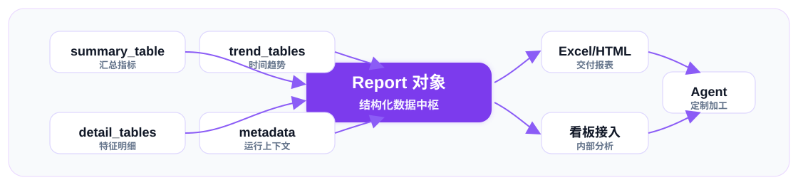

# MARS

<div align="center">


<h2 align="center">面向信贷风控分析与建模的 Polars-first 高性能工具库</h2>

[](https://pypi.org/project/mars-risk/)
[](https://pypi.org/project/mars-risk/)
[](https://pepy.tech/project/mars-risk)
[](https://github.com/leeesq/mars-risk/actions/workflows/test.yml)
[](LICENSE)

 Bin/Evaluate -> Analyze -> Select -> Modeling Pipeline -> Monitor TODO -> Report" width="920">

[项目简介](#项目简介) · [设计原则](#设计原则) · [能力地图](#能力地图) · [性能对比](#性能对比) · [安装](#安装) · [快速开始](#快速开始) · [核心-api-约定](#核心-api-约定) · [Modeling Pipeline](#modeling-pipeline) · [报表导出](#excelhtml-报表导出与二次加工) · [FAQ](#faq)

</div>

## 项目简介

MARS 覆盖数据画像、分箱评估、特征分析、特征筛选、Modeling Pipeline、特征监控、模型监控和 Excel/HTML 报表导出。它以宽表特征为主线，串联训练前分析、建模期调参与评估、上线后特征监控、模型监控和报表导出，让日常风控建模流程更容易复用、审计和交付。

MARS 将数据质量、分箱规则、指标评估、特征筛选、模型调参与评估结果、导出产物组织在同一套结构化报告体系中。使用者既可以直接生成 Excel/HTML 报表，也可以读取各模块返回的多粒度数据，继续做特征复盘、监控规则定制、内部看板接入或定制化分析。

## 设计原则

- **性能优先**：面向宽表、大样本、多特征风控场景，核心计算优先使用 Polars，减少不必要的数据复制和跨框架转换。
- **sklearn 风格**：底层算法对象保持 `fit` / `transform` / `evaluate` 等熟悉范式，便于接入现有建模实验和 Pipeline。
- **Pandas/Polars 兼容**：核心计算优先走 Polars，同时兼容 Pandas 和 Polars 的输入与输出；需要保持原类型的链路尽量减少无意义转换。
- **风控全链路**：围绕数据画像、分箱评估、特征分析、特征筛选、Modeling Pipeline、特征监控、报表导出组织能力。
- **模块可串联**：分箱规则、指标明细、筛选结果、模型结果和 report 对象可在模块间复用，减少 Notebook、Excel 和零散脚本中的重复加工。
- **补齐开源空白**：聚焦通用开源工具通常覆盖不足的信贷风控宽表分析、特征监控、报表交付和可复盘数据对象。
- **可审计与可二次加工**：各模块 report 保留多粒度结构化表，支持 Excel/HTML 导出、内部看板接入，以及借助 Agent 做定制化摘要和报告重排。

## 能力地图

模块链路：数据画像 -> 分箱评估 -> 特征分析 -> 特征筛选 -> Modeling Pipeline -> 特征监控 -> 模型监控 TODO -> Excel/HTML 报表导出。

| 模块 | 主 API | 典型问题 | 主要产出 |
| --- | --- | --- | --- |
| 数据画像 | `MarsDataProfiler` / `profile_stats` | 缺失率、零值、均值/分布、PSI、时间趋势、特征来源分组 | `MarsProfileReport` |
| 分箱评估 | `MarsNativeBinner` / `MarsOptimalBinner` / `MarsBinEvaluator` / `profile_risk` | 连续/类别分箱、IV、KS、AUC、Lift、分箱规则复用、部署转换、SQL 生成 | `MarsRiskProfile`、`MarsEvaluationReport`、分箱规则 |
| 特征分析 | `MarsDataProfiler` / `profile_stats` / `profile_risk` | 特征质量、单变量风险、稳定性、分布变化、业务特殊值影响 | 画像表、指标明细、趋势表 |
| 特征筛选 | `MarsStatsSelector` / `MarsLinearSelector` / `MarsImportanceSelector` | 质量筛选、稳定性、相关性、模型重要性 | `selected_features_`、筛选报告 |
| Modeling Pipeline | `MarsModelingSession` / `MarsModelTuner` / `MarsModelReplayRunner` / `MarsModelEvaluator` | train/val/oot 切分、模型调参、benchmark 对比、Top-K replay、重要性表、建模评估报告 | `MarsModelTuningResult`、`MarsModelReplayResult`、`MarsModelingReport` |
| 特征监控 | `MarsBinEvaluator` / `profile_risk` | PSI、缺失趋势、分箱趋势、Lift、按月/周/分组监控 | `MarsEvaluationReport` |
| 模型监控（TODO） | TODO | 模型上线后稳定性、模型分分箱趋势、漂移监控、监控报表 | TODO |
| Excel/HTML 报表导出 | `write_excel` / `write_html` / `build_scorecard` | 画像报表、风险评估报表、建模评估报表、评分卡映射、部署 SQL | Excel、HTML、`MarsScorecard` |

## 性能对比

面向宽表分箱场景，MARS 重点优化大样本、多特征下的分箱拟合、规则转换和报表链路衔接。可用以下命令复现测试结果：

```bash
conda run -n mars python benchmarks/benchmark_binning_speed.py native --rows 200000 --features 3000 --repeats 1
conda run -n mars python benchmarks/benchmark_binning_speed.py optimal --rows 50000 --features 1000 --repeats 3
```

- 计时范围：数据生成 + fit + transform + 本轮清理
- 内存口径：主进程及其子进程的 RSS；结束增量为本轮结束 RSS - 起始 RSS，峰值增量为采样峰值 RSS - 起始 RSS
- Python：`3.10.19`；系统：`Windows-10-10.0.26200-SP0`
- 结束增量会受 Python、Polars、NumPy 内存分配器缓存影响；比较峰值压力时优先看“峰值增量”

### 原生分箱：toad vs MarsNativeBinner

- 数据规模：`200,000` 行 × `3,000` 个数值特征
- 重复次数：`1`；随机种子：`2026`

| 场景 | 方法 | 平均耗时(s) | 最快(s) | 最慢(s) | 平均结束增量(MB) | 峰值增量(MB) | 相对基准 | 备注 |
| --- | --- | ---: | ---: | ---: | ---: | ---: | ---: | --- |
| 等频分箱 | toad Combiner + WOETransformer | 126.083 | 126.083 | 126.083 | 30.7 | 20516.1 | 1.60x | |
| 等频分箱 | MarsNativeBinner | 78.768 | 78.768 | 78.768 | 3348.2 | 6768.8 | 1.00x | method=quantile |
| 等宽分箱 | toad Combiner + WOETransformer | 105.859 | 105.859 | 105.859 | 6.7 | 20468.4 | 1.31x | |
| 等宽分箱 | MarsNativeBinner | 81.058 | 81.058 | 81.058 | -7.8 | 6727.7 | 1.00x | method=uniform |

### 原生等频/等宽的额外能力

MARS 的原生等频/等宽分箱不只是生成切点。围绕风控特征分析和监控，这些处理统一沉淀在同一套规则对象中，便于后续分析、监控和导出复用：

- 缺失值、`NaN`、自定义 `missing_values` 和业务特殊值 `special_values` 会独立隔离，不挤占正常分箱数量。
- `merge_small_bins` 可在等频/等宽后自动合并低占比碎片箱，减少极端宽表中的不稳定分箱。
- `remove_empty_bins` 可在等宽场景自动清理空箱，适配长尾、零膨胀和稀疏分布。
- 原生分箱支持处理类别特征，最优分箱支持类别合并，用于降低高基数类别带来的不稳定性。
- 分箱规则可以继续进入特征分析、特征监控、Modeling Pipeline 结果和后续监控报表，减少从探索到部署之间的规则重写。

### 最优分箱：MarsOptimalBinner vs optbinning

- 数据规模：`50,000` 行 × `1,000` 个数值特征
- 重复次数：`3`；随机种子：`2026`

| 场景 | 方法 | 平均耗时(s) | 最快(s) | 最慢(s) | 平均结束增量(MB) | 峰值增量(MB) | 相对基准 | 备注 |
| --- | --- | ---: | ---: | ---: | ---: | ---: | ---: | --- |
| 最优分箱 | MarsOptimalBinner | 28.011 | 26.627 | 29.189 | 282.0 | 5531.5 | 1.00x | 单特征 time_limit=1s |
| 最优分箱 | optbinning.BinningProcess | 125.826 | 124.474 | 126.538 | 17.0 | 628.4 | 4.49x | 单特征 time_limit=1s |

## 安装

MARS 支持 `Python >= 3.10`。

```bash
pip install mars-risk
```

| 场景 | 安装命令 |
| --- | --- |
| 基础能力（含画像、分箱、筛选、Excel/HTML 报表和图表报告） | `pip install mars-risk` |
| Notebook 交互 | `pip install "mars-risk[notebook]"` |
| 树模型与调参 | `pip install "mars-risk[ml,tuning]"` |
| 本地开发 | `pip install -e ".[dev,ml,tuning]"` |

```bash
git clone https://github.com/leeesq/mars-risk.git
cd mars-risk
pip install -e ".[dev,ml,tuning]"
```

## 快速开始

下面的示例保持短小，展示主链路的新 API 约定。

### 准备样本

```python
import polars as pl

df = pl.DataFrame(
    {
        "apply_dt": [
            "2024-01-03", "2024-01-10", "2024-01-17", "2024-01-24",
            "2024-02-03", "2024-02-10", "2024-02-17", "2024-02-24",
            "2024-03-03", "2024-03-10", "2024-03-17", "2024-03-24",
        ],
        "month": [
            "2024-01", "2024-01", "2024-01", "2024-01",
            "2024-02", "2024-02", "2024-02", "2024-02",
            "2024-03", "2024-03", "2024-03", "2024-03",
        ],
        "income": [3200, 3600, -999, None, 3300, 4200, -999, 5800, 3400, 4300, None, 6100],
        "utilization": [0.12, 0.18, 0.52, 0.61, 0.14, 0.29, 0.54, 0.58, 0.16, 0.31, 0.56, 0.63],
        "segment": ["new", "repeat", "vip", "vip", "new", "repeat", "vip", "vip", "new", "repeat", "vip", "vip"],
        "target": [0, 0, 1, 1, 0, 1, 1, 1, 0, 1, 1, 1],
    }
)
```

### 数据画像

```python
from mars.analysis import MarsDataProfiler, profile_stats

profiler = MarsDataProfiler(missing_values=[-999])
profile_report = profiler.generate_profile(
    df,
    group_col="month",
    config_overrides={
        "enable_sparkline": False,
        "dq_metrics": ["missing", "zeros"],
        "stat_metrics": ["mean", "psi"],
    },
)

quick_report = profile_stats(
    df,
    metrics=["missing", "mean"],
    features=["income", "utilization"],
    group_col="month",
    missing_values=[-999],
)
```

### 分箱评估

```python
from mars.analysis import profile_risk

risk_profile = profile_risk(
    df,
    target="target",
    features=["income", "utilization", "segment"],
    group_col="month",
    binning_type="native",
    binner_params={"method": "quantile", "n_bins": 4},
    plot=False,
)

eval_report = risk_profile.report
binner = risk_profile.binner
summary = eval_report.summary_table
```

`profile_risk()` 返回 `MarsRiskProfile(report, binner, targets, metadata)`。`report` 用于查看和导出分箱评估报表，`binner` 用于复用本次分箱规则。

### 分箱器

```python
from mars.feature import MarsNativeBinner

X = df.select(["income", "utilization", "segment"])
y = df.get_column("target")

binner = MarsNativeBinner(method="quantile", n_bins=4, special_values=[-999])
binner.fit(X, y, cat_features=["segment"])

X_bin = binner.transform(X, return_type="index")
X_woe = binner.transform(X, return_type="woe")
income_mapping = binner.get_bin_mapping("income")
```

### 特征筛选

```python
from mars.feature import MarsStatsSelector

selector = MarsStatsSelector(
    missing_thr=0.9,
    iv_thr=0.01,
    psi_thr=0.25,
    skip_fine_scan=True,
)

selector.fit(
    df,
    target="target",
    features=["income", "utilization", "segment"],
    group_col="month",
)

selected_features = selector.selected_features_
selection_report = selector.get_eval_report(df)
```

### Modeling Pipeline

建模调参需要安装 `ml` 和 `tuning` 可选依赖。

```python
from mars.modeling import MarsModelingSession
from mars.modeling.tuning import MarsModelReplayRunner

session = MarsModelingSession(
    model_type="xgb",
    features=["income", "utilization", "segment"],
    target="target",
    categorical_features=["segment"],
    optimize_metric="ks",
    seed=1206,
)

modeling_df = session.slice(
    df,
    time_col="apply_dt",
    split_ratios={"train": 0.6, "val": 0.2, "oot": 0.2},
)

tuning_result = session.tune(
    modeling_df,
    n_trials=20,
    history_path=None,
)

replay_result = MarsModelReplayRunner().run(
    tuning_result,
    modeling_df,
    top_k=3,
    sort_metric="ks",
)
```

## 核心 API 约定

| 场景 | 约定 |
| --- | --- |
| 高层风控工作流 | 使用 `df, target`，例如 `profile_risk(df, target="y")` |
| 底层算法对象 | 使用 `X, y`，例如 `MarsNativeBinner().fit(X, y)` |
| 构造函数 | 放稳定策略、阈值、模型规格，不放本次样本数据 |
| 方法入参 | 放数据、列名、特征范围、分组、时间、输出路径 |
| 分组命名 | `group_col` 是已有分组列，`time_col` 是原始日期列，`time_grain` 是聚合粒度 |
| 建模切片 | `dataset_flag_col` 只表示 train/val/oot 等建模样本切片 |
| 文件输出 | 路径参数支持 `str | Path`；`history_path=None` 表示不写调参历史文件 |

## Modeling Pipeline

Modeling Pipeline 仍在快速迭代中，可能不稳定；后续接口约定、结果对象和调参参数都可能发生较大变动。

当前支持 XGBoost（`xgb`）、LightGBM（`lgb`）、CatBoost（`cbt` / `cat` / `catboost`）和 Logistic Regression（`lr` / `logistic`）。逻辑回归支持 numeric 与 WOE 两种特征模式。

| API | 职责 | 返回值 |
| --- | --- | --- |
| `MarsModelDataSplitter` | 无状态样本切分工具 | 与输入类型一致的 DataFrame |
| `MarsModelingSession` | 组织切分、调参、replay 和增量特征调参 | 会话对象 |
| `MarsModelTuner` | 对单个模型后端执行 Optuna 调参 | `MarsModelTuningResult` |
| `MarsModelReplayRunner` | 从调优结果中读取规格并回放 Top-K trial | `MarsModelReplayResult` |
| `MarsModelEvaluator` | 对已打分样本构建建模评估报告 | `MarsModelingReport` |
| `MarsFeatureIncrementalTuner` | 按特征数量逐步扩展调参 | `MarsFeatureGrowthResult` |

`MarsModelTuningResult` 会保存最佳模型、调参历史、特征重要性、训练配置和 artifact 元数据。`MarsModelReplayResult` 会保存 replay leaderboard、模型字典、打分数据、评估报告和重要性表。

模型分可以被视为一个特殊特征进入稳定性观察。当前 `MarsModelEvaluator` 是建模评估器，已输出 `Score PSI` 和 `score_psi` 明细，用于建模评估阶段观察模型分在 train/val/oot 或业务切片之间的分布漂移。

完整模型监控仍为 TODO，后续补充模型分分箱后的趋势统计、上线后漂移监控和监控报表。

## Excel/HTML 报表导出与二次加工

<div align="center">
  
</div>

画像、风险评估、建模评估和评分卡结果都以对象形式返回。`MarsProfileReport`、`MarsEvaluationReport`、`MarsModelingReport` 等 report 对象会保留 `summary_table`、`detail_table` / `detail_tables`、`trend_tables`、`metadata` / `report_meta` 等结构化数据，使用者可以按模块、特征、分组、时间或样本切片继续加工。

这些多粒度表格适合继续做特征复盘、监控规则定制、内部看板接入和定制化分析，也便于借助 Agent 基于明细表进行摘要、筛选、解释和报告重排。需要交付给业务或评审时，可以直接导出 Excel/HTML：

```python
profile_report.write_excel("mars_profile.xlsx")
eval_report.write_excel("mars_evaluation.xlsx", engine="openpyxl")
eval_report.write_html("mars_evaluation.html")
```

评分卡链路支持从逻辑回归模型和 WOE 分箱结果生成分数映射，并导出 SQL 规则。

## 公开 API 概览

| 导入位置 | 公开对象 |
| --- | --- |
| `mars.analysis` | `MarsDataProfiler`、`MarsBinEvaluator`、`MarsRiskProfile`、`profile_stats`、`profile_risk` |
| `mars.feature` | `MarsNativeBinner`、`MarsOptimalBinner`、`MarsStatsSelector`、`MarsLinearSelector`、`MarsImportanceSelector` |
| `mars.modeling` | `MarsModelingSession` |
| `mars.modeling.tuning` | `MarsModelTuner`、`MarsModelReplayRunner` |
| `mars.modeling.slicing` | `MarsModelDataSplitter` |
| `mars.modeling.results` | `MarsModelTuningResult`、`MarsModelReplayResult` |
| `mars.modeling.feature_growth` | `MarsFeatureGrowthResult`、`MarsFeatureIncrementalTuner` |
| `mars.scoring` | `MarsScorecard`、`build_scorecard` |

## 可选依赖

- `mars-risk` 基础安装已包含 Excel/HTML 报表导出和绘图报告依赖。
- `notebook`：Notebook 交互展示。
- `ml`：XGBoost、LightGBM、CatBoost、SHAP、statsmodels。
- `tuning`：Optuna 调参。

## 测试与开发

```bash
python -m ruff check src tests benchmarks
python -m mypy src/mars
MPLBACKEND=Agg python -m pytest -q --basetemp .pytest-tmp
```

本仓库使用 `src/` 包结构，并声明 `mars/py.typed`。提交 Python 代码时，请保持类型注解、NumPy 风格 docstring、中文自然语言注释和 README/教程同步。

## FAQ

### `profile_risk()` 返回什么？

返回 `MarsRiskProfile(report, binner, targets, metadata)`。其中 `report` 是风险评估报告，`binner` 是本次拟合或复用的分箱器，`targets` 是目标列列表，`metadata` 保存运行上下文。

### 为什么高层 API 用 `target`，底层对象用 `y`？

高层 API 面向完整业务表，目标变量是某个列名，所以使用 `df, target`。底层算法对象面向特征矩阵和标签向量，所以使用 `X, y`。这样可以避免同一个方法里同时出现列名和标签向量两种语义。

### `MarsModelTuner.tune(history_path=None)` 会写文件吗？

不会。`history_path=None` 时调参历史只保存在返回对象中。传入路径时才写 CSV；如果路径已存在且 `overwrite=False`，会抛出 `FileExistsError`。

### Pandas 和 Polars 都能用吗？

可以。核心计算优先走 Polars；Pandas 输入会在需要时转换或保持原类型返回。建模切分器会根据输入类型选择对应实现，避免不必要的跨框架转换。

## 路线图

- 继续扩展模型评估、特征监控和报表导出的测试覆盖。
- 设计模型监控模块，覆盖模型分分箱趋势统计、上线后漂移监控和监控报表。
- 增强评分卡 SQL 和 artifact 回放能力。
- 持续收敛 public API 命名和类型注解。

## 参与方式

欢迎提交 issue、测试用例、文档修正和真实建模场景反馈。PR 请附上最小复现、测试命令和对 public API 的影响说明。

## 许可证

本项目使用 [LICENSE](LICENSE) 中声明的开源许可证。
