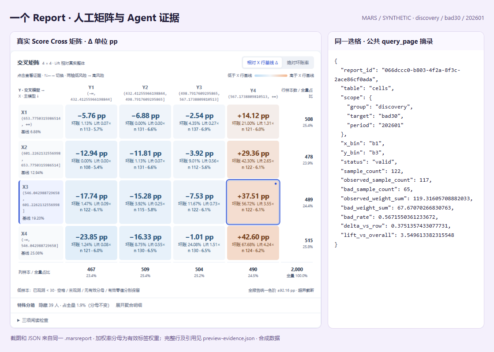
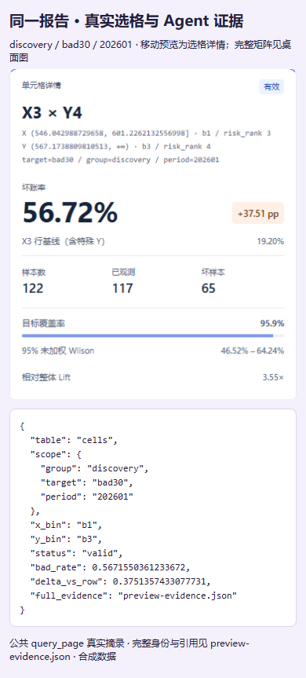

# 从问题选择实战案例

**数据画像 · 分箱评估 · 特征筛选 · 相关性分析 · 模型分交叉 · 规则挖掘**。
从一份合成申请数据开始，先判断能否分析，再比较特征、复核候选规则，最后保存和交付同一份报告。
人工图表与 Agent JSON 都读取实际 Report；以下示例回答由人工依据确定性查询整理，不是 LLM 实验。

<div class="mars-cases" markdown="1">

<div class="mars-case-grid" markdown="1">

<div class="mars-case-card" markdown="1">

**01 · 数据画像**

### [这份数据能直接用吗？](data-quality.md)

样本与有效标签、missing/special、schema 差异和未见类别。

--8<-- "docs/assets/cases/previews.txt:card1"

[真实质量摘要与前置检查 →](data-quality.md)

</div>

<div class="mars-case-card" markdown="1">

**02 · 分箱评估**

### [哪些特征有区分度，而且稳定？](binning-stability.md)

固定参考分箱，比较不同分区与目标的 IV、KS、PSI 和箱风险。

--8<-- "docs/assets/cases/previews.txt:card2"

[真实指标与分箱证据 →](binning-stability.md)

</div>

<div class="mars-case-card" markdown="1">

**03 · 特征筛选 · 相关性分析**

### [为什么保留这个，删除另一个？](selection-correlation.md)

候选、步骤与取舍审计；raw 与目标感知 WOE 分开读取。

--8<-- "docs/assets/cases/previews.txt:card3"

[筛选决策 →](selection-correlation.md) · [相关性证据 →](selection-correlation.md#correlation)

</div>

<div class="mars-case-card" markdown="1">

**04 · 模型分交叉**

### [同一主等级内，辅助分还有用吗？](score-cross.md)

矩阵、Δ pp、Lift、双向梯度、选格与聚合 policy 回放。

--8<-- "docs/assets/cases/previews.txt:card4"

[真实交互与格子查询 →](score-cross.md)

</div>

<div class="mars-case-card" markdown="1">

**05 · 规则挖掘 · Experimental**

### [候选规则如何变成可审查证据？](rule-evidence.md)

发现来源、候选审计、独立验证和未通过原因。

--8<-- "docs/assets/cases/previews.txt:card5"

[真实发现与验证结果 →](rule-evidence.md)

</div>

<div class="mars-case-card" markdown="1">

**06 · 公共报告查询与保存**

### [分析完成后，如何保存并继续查询？](saved-reports.md)

新进程只加载快照；分页、预算、空结果与无效请求。

--8<-- "docs/assets/cases/previews.txt:card6"

[独立加载与查询轨迹 →](saved-reports.md)

</div>

<div class="mars-case-card" markdown="1">

**07 · 公共报告交付**

### [同一次分析，如何交付给不同使用者？](report-delivery.md)

HTML、静态 Excel、快照、有限 JSON 和外部 Agent TXT 的真实边界。

--8<-- "docs/assets/cases/previews.txt:card7"

[格式、下载与值对齐 →](report-delivery.md)

</div>

</div>

<div class="mars-case-preview" markdown="1">

<div class="mars-preview-desktop" markdown="1">

[](score-cross.md)

</div>

<div class="mars-preview-mobile" markdown="1">

[](score-cross.md)

</div>

固定主模型等级后查看辅助分的风险梯度；矩阵、选格详情和 Agent 查询来源相同。
[打开真实交互报告](../assets/cases/score-cross.html) · [查看公共查询证据](../assets/cases/case-4.json)

</div>

</div>

## 先看产物能力，再选择格式 { #formats }

下表描述本轮实际生成路线。案例 6/7 复用已有报告和共享包，不复制七套计算或快照。
文件目录、大小、哈希和同批报告身份见[manifest.json](../assets/cases/manifest.json)。

| 案例 | 报告／真实结果 | HTML | 静态 Excel | .marsreport | 有限 JSON / TXT |
| --- | --- | --- | --- | --- | --- |
| 1 数据能否使用 | MarsProfileReport；案例侧 schema/未见类别前置检查 | profile.html | profile.xlsx | profile.marsreport | case-1.json |
| 2 区分度与稳定性 | MarsBinningReport | binning.html | binning.xlsx | binning.marsreport | case-2.json |
| 3 筛选与相关性 | 真实 selector 决策；raw / WOE CorrelationReport | correlation.html | selection.xlsx / correlation.xlsx | raw-correlation / woe-correlation | case-3.json / selection.json |
| 4 辅助分交叉 | ScoreCrossReport；已有 policy 聚合回放 | score-cross.html | score-cross.xlsx / policy.xlsx | score-cross / policy | case-4.json |
| 5 候选规则证据 | MarsRuleReport（Experimental） | rules.html | rules.xlsx | rules.marsreport | case-5.json；RuleSet 仅在真实资格允许时 |
| 6 保存后查询 | 复用交叉 ReportSnapshot＋关联 policy | 复用 | 复用 | 复用 | case-6.json / agent-context.json |
| 7 多种交付 | 复用同批报告与导出 | 复用 | 复用 | 复用 | case-7.json / external-agent-task.txt |

## 一套合成数据贯穿任务 { #data-dictionary }

公开展示用 seed `20261001`、18,000 行合成申请；由一份浅层生成逻辑生成。
发现／参考、验证、观察各 6,000 个独立 ID，时间范围分别为 2026 年 1–3、4–6、7–9 月。
分箱只在发现／参考集拟合，验证和观察复用；规则发现与验证分离。
`bad30`、`late60` 是分别生成的模拟表现标签，缺失标签不补成好样本。

| 字段组 | 语义 |
| --- | --- |
| sample_id / application_date / dataset | 合成申请身份、日期、独立分区；不是用户业务记录 |
| main_score / aux_score | 主分高分低风险，辅助分高分高风险；不是新训练模型 |
| 数值／类别与冗余字段 | 用于质量、稳定性、筛选和相关性；完整字段字典见机器可读来源 |
| bad30 / late60 | 两个独立合成目标；有效标签分母按目标分别统计 |
| amount / 权重字段 | 仅按本次接口实际配置计算，不把金额解释为损失或利润 |
| missing / special / invalid / unseen | 按已运行案例呈现；不把所有检查包装成核心公共 API |

分布统计用全量样本；标签指标用有效标签人数。坏率和缺失率为比例，KS 为 0–100，
IV、PSI、Lift 无量纲，Δ 用百分点（pp）。各页说明真实口径与特殊箱范围。
观察期 `late60` 全部未表现，只支持该目标的分布结论；`bad30` 仍保留模拟标签。
这些标签均不支持现实效果或收益外推。

## 运行与下载 { #run }

这组案例随当前源码 `0.0.28` 维护；PyPI 发布边界见[安装页](../getting-started/installation.md)。
先克隆包含本轮案例的源码分支，在仓库根目录安装。所有核心案例无需 API Key、联网 LLM 或可选模型训练 extra。
本批公开结果由 Python 3.11.15、Pandas 3.0.3、Polars 1.42.0 运行，
完整依赖和源码导入／已安装 distribution 的区别见[生成环境](../assets/cases/generation-environment.json)。

```bash
python -m pip install -e ".[docs]"
python docs/snippets/task_cases.py --output-dir output/task-cases --rows 18000 --seed 20261001
```

[完整共享源码](../snippets/task_cases.py) · [共享下载包](../assets/cases/cases.zip) ·
[真实结果摘要](../assets/cases/summary.json) · [生成来源与文件哈希](../assets/cases/manifest.json)

包包含预生成结果及复现材料；从源码重新运行会生成新的报告身份，但同批引用保持关联。
数据和统计可复现，不要求时间戳、报告身份或 ZIP/Excel 二进制逐字节不变。
轻量 CI 夹具使用 900 行，只验证 API 与语义，不能代替 18,000 行公开数字。

[历史 LightGBM 案例与维护边界](history.md) · [保留的 Score Cross Notebook](correlation_and_score_cross.ipynb) ·
[详细参数与 API](../reference/index.md) · [本轮验收记录](../project/task-cases-validation.md)
