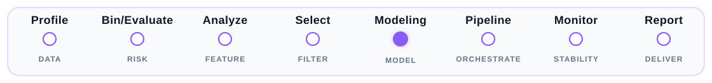

# MARS

  
  
  
  

MARS 是面向信贷风控宽表的 Polars-first 分析与建模工具库。它把数据质量、分箱规则、
特征筛选、建模评估、监控指标和结构化报告串成可复用的工作流；既可直接导出 Excel/HTML，
也可把 report 表接入内部看板或二次分析。

## 从你的任务开始

<a class="mars-task-card" href="user-guide/data-profiling/">
  <strong>检查数据质量</strong>
  缺失、零值、分布、PSI 与数据源维度
  <em>MarsDataProfiler</em>
</a>

<a class="mars-task-card" href="user-guide/binning-risk-evaluation/">
  <strong>评估特征风险</strong>
  分箱、IV、KS、AUC、Lift、PSI 与风险趋势
  <em>profile_risk / MarsBinEvaluator</em>
</a>

<a class="mars-task-card" href="user-guide/feature-selection/">
  <strong>筛选候选特征</strong>
  质量、稳定性、相关性与模型重要性
  <em>MarsStatsSelector</em>
</a>

<a class="mars-task-card" href="user-guide/modeling-pipeline/">
  <strong>训练与复现实验</strong>
  样本切分、调参、replay、WOE 与 Pipeline
  <em>MarsModelingSession</em>
</a>

<a class="mars-task-card" href="user-guide/monitoring/">
  <strong>监控特征或模型</strong>
  分布漂移、缺失趋势、表现覆盖率与报警摘要
  <em>MarsMonitor</em>
</a>

<a class="mars-task-card" href="user-guide/reports-and-exports/">
  <strong>交付或检索报告</strong>
  Excel、可检索 HTML、趋势图资产与结构化表
  <em>write_html / write_excel</em>
</a>

## 推荐路径

| 你的起点 | 先读 | 再读 |
| --- | --- | --- |
| 第一次使用 MARS | [安装](getting-started/installation.md) → [10 分钟 Quickstart](getting-started/quickstart.md) | [核心 API 约定](getting-started/api-conventions.md) |
| 五月建箱、六月评估或监控 | [分箱与风险评估](user-guide/binning-risk-evaluation.md) | [特征/模型监控](user-guide/monitoring.md) |
| 需要生成或分享大报告 | [报告导出与二次加工](user-guide/reports-and-exports.md) | [Report 对象](reference/report-objects.md) |
| 需要精确签名和默认值 | [API Reference](reference/index.md) | 对应用户指南的场景说明 |

## 三个常用契约

**趋势图需要真实日期。** 风险趋势图必须有有效 `time_col`；`group_col` 决定面板分组，
时间范围只来自 `time_col`，并显示为 `YYYY-MM-DD`。仅未传 `group_col` 时，
`time_grain` 才用于生成时间分组。

**benchmark 是基准期样本。** 在 `MarsBinEvaluator.evaluate()` 和 `MarsMonitor.monitor()`
中，规则来源优先级为显式 `binner`、`benchmark_df`、当前 `df`。`benchmark_df` 同时是
PSI 的 expected distribution；`profile_risk()` 不接收显式 `binner`。

**report 是可继续使用的数据对象。** `summary_table`、`detail_table`、`trend_tables` 和
`metadata` 不只是导出中间产物，可用于看板、复盘和定制化报告。

## 能力地图

| 模块 | 主要入口 | 常见产出 |
| --- | --- | --- |
| 数据画像 | `MarsDataProfiler`、`profile_stats` | `MarsProfileReport` |
| 分箱评估 | `profile_risk`、`MarsBinEvaluator` | `MarsRiskProfile`、`MarsBinningReport` |
| 特征筛选 | `MarsStatsSelector`、`MarsLinearSelector`、`MarsImportanceSelector` | `selected_features_`、筛选报告 |
| 建模与编排 | `MarsModelingSession`、`MarsModelingPipeline` | 调参、replay、评估和 Pipeline 结果 |
| 监控 | `MarsMonitor`、`generate_monitoring_alert` | `MarsMonitoringReport`、报警摘要 |
| 报告与评分卡 | `write_excel`、`write_html`、`build_scorecard` | Excel、HTML、`MarsScorecard` |

## 边界

MARS 提供风险计算、结构化 report 和默认摘要；它不是完整的线上监控平台、模型注册中心、
调度系统或审批系统。监控窗口、模型版本、阈值策略、看板和处置流程由使用者结合内部系统定义。
